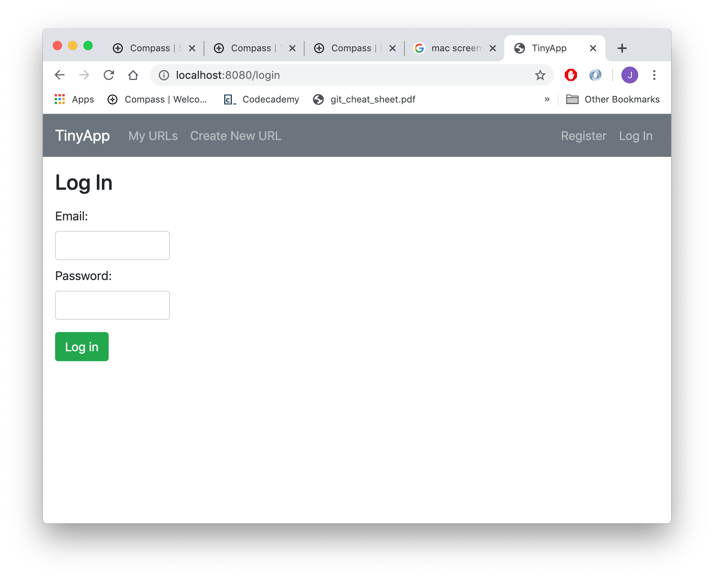
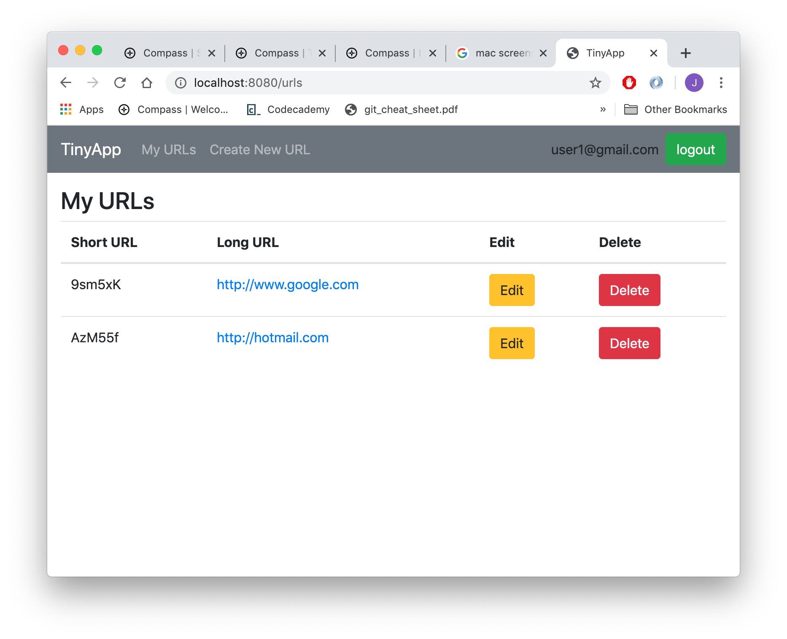
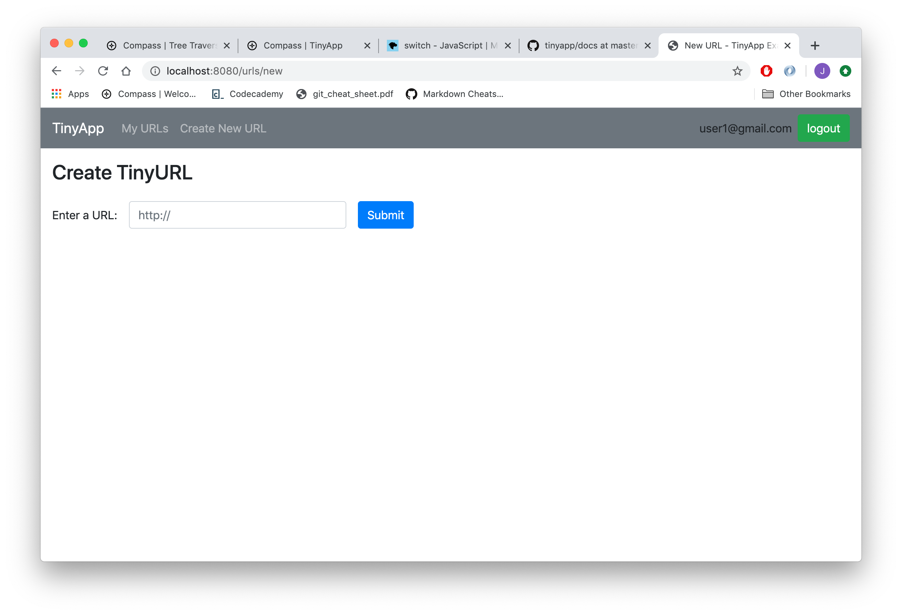
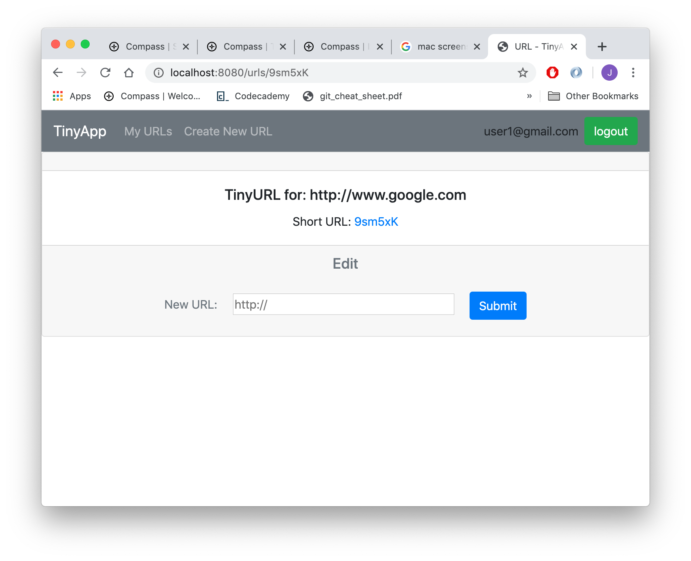

# TinyApp Project

TinyApp is a full stack web application built with Node and Express that allows users to shorten long URLs (à la bit.ly).

## Final Product

#### Login Page / Register Page
This is login page and can be accesed by clicking 'Log in' on the right side of top nav bar. A user who has an account can enter the app through this page using email and password.

If a user who is not logged in attempts to access a page that isn't register, login, or error page, the user will be redirected back to this page. Also, if a user enters unregistered email or wrong password, the user will be redirected to 403 error page.

Register page has similar layout and it can be accessed by clicking 'Register' on the right side of top nav bar. In register page a user can register new account. However, if the user enters registered email, the user will be redirected to 400 error page.

A user who is logged in cannot access login or register page while logged in as it will redirect the user back to my URLs page, but once logged out will be returned to login page.

#### my URLs Page
This is my URLs page and can be accessed by clicking 'my URLs' on the left side of top nav bar. A user who is logged in can see and access list of URLs the user added to the app. By default a new user has no URL on the list.

If a user has added URLs previously, each of the URLs will show up on the list with following:
shortened URL link
original URL link
edit button: enters edit page where the user can remove URL from the list and add another URL
delete button: delete URL from the list

#### create new URL Page
This is create new URL page and can be accessed by clicking 'create new URL' on the left side of top nav bar. A user can add new URLs to list on the my URLs page one at a time by entering a new URL here.

By default, if a user enters a URL without protocol identifier 'http://' the app will add it to the front of given URL before processing the request. It attempts to establish connection with the given URL and if it can find the website, it will add the URL to the list. If it fails to find the website the app will redirect the user to 0 error page and the list won't be modified.

Once the URL is successfully added to the user's list, the user will be redirected to my URLs page.

#### create new URL Page
This is edit page and can be accessed by clicking 'edit' on each of the edit button on my URLs page's list.

A user can remove URL currently displaying on the page from the list and add another URL that the user enters to the list. Same as create new URL, the app will add 'http://' to URL without protocol identifier, and attempts to establish connection with the given URL. If it can find the website, it will add the new URL to the list and delete the previous one from the user's list. If it fails to find the website the app will redirect the user to 0 error page and the list won't be modified.

Once the URL is successfully added to the user's list, the user will be redirected to my URLs page.

## Dependencies

- Node.js
- Express
- EJS
- bcrypt
- body-parser
- cookie-session
- request
- nodemon

## Getting Started

- Install all dependencies (using the `npm install` command).
- Run the development web server using the `node express_server.js` or `npm start` command.